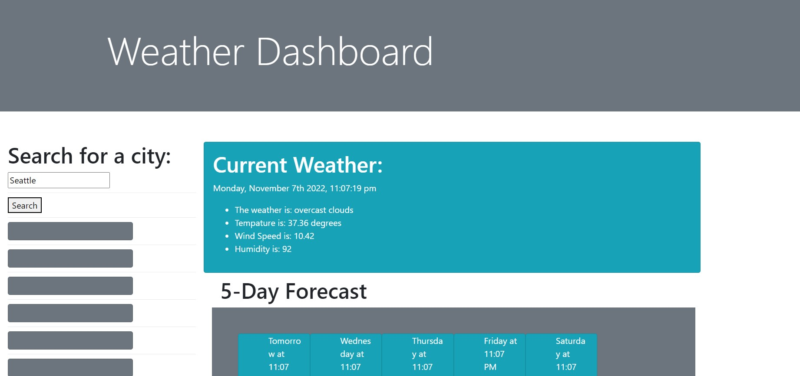
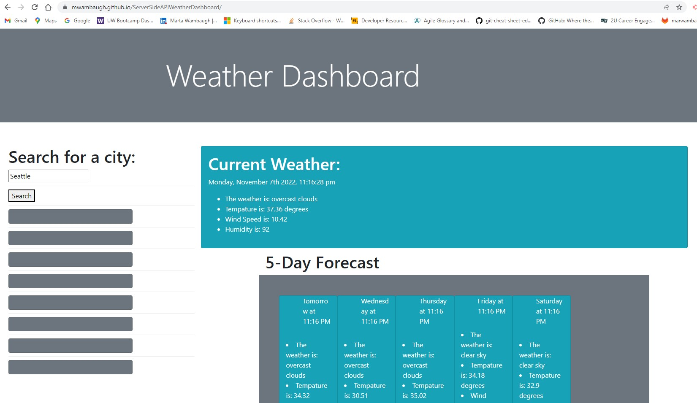

# ServerSideAPIWeatherDashboard
This third-party API weather dashboard project featuring dynamically updated HTML and CSS and using third-party API's. 

# User Story 
AS A traveler
I WANT to see the weather outlook for multiple cities
SO THAT I can plan a trip accordingly

# Acceptance Criteria 
GIVEN a weather dashboard with form inputs
WHEN I search for a city
THEN I am presented with current and future conditions for that city and that city is added to the search history
WHEN I view current weather conditions for that city
THEN I am presented with the city name, the date, an icon representation of weather conditions, the temperature, the humidity, and the the wind speed
WHEN I view future weather conditions for that city
THEN I am presented with a 5-day forecast that displays the date, an icon representation of weather conditions, the temperature, the wind speed, and the humidity
WHEN I click on a city in the search history
THEN I am again presented with current and future conditions for that city

# Usage
This practice will provide future potential employers the opportunity to see student works in early learning of Java-Script, and API's such as Bootstrap and jQuery.

# Features
This deployed and functional Weather Dashboard will respnd to the user typing in a city, the code will calculate the coordinates and provide current weather as well as a five day forecast of the area. When this dashboard is fully functionional, it will additionally save searches desplyed in the grey rectangles under the search section allowing the user to re-visit recent weather information. 

# Links
[Link to deployed website] (https://mwambaugh.github.io/ServerSideAPIWeatherDashboard/) 
[GitHub Repository] (https://github.com/mwambaugh/ServerSideAPIWeatherDashboard) 

# Visuals 

# Contributing:
This assignment was worked on by student, M.C. Wambaugh, with the support of her TA's during office hours and meeting regularly with a tutor. The student also used universial resources such as  W3schools.com, FreeCodeCamp.org, Moment, Bootstrap, and jQuery. Many thanks to those who continue to support learning in the technological community.

# License 
[MIT](https://choosealicense.com/licenses/mit/) 